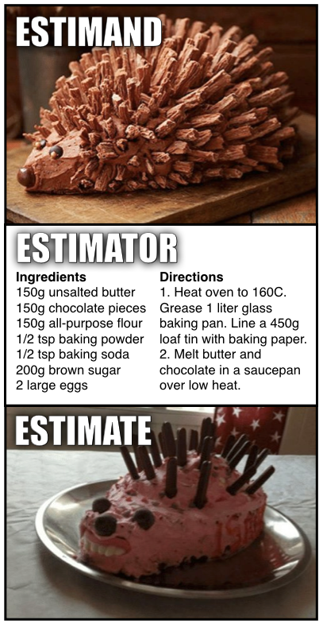

```{r setup, purl=FALSE}
#| include: false
options(width = 68)
set.seed(7)
knitr::opts_chunk$set(eval=TRUE, echo=FALSE, message=FALSE, warning=FALSE, dev = "svg", fig.height = 4)
library(tidyverse)
library(flextable)
```


# Outline

### Writing in General

### Describing Methods

### Presenting Results

## Tables

## Charts

---

class: inverse

# Writing

<br>


---

# Matsueda (2019)

.pull-left-70[
* Empirical, especially quantitative, writing has a common structure
   * Efficient for communication
   * Hourglass shape
   
* Mimic others:
   * Articles in prominent outlets
   * Good writers
   
* Highlight your contributions

* Literature reviews are important
   * Position your work
   * Argument and conversation, not summary
]

.pull-right-30[

]


---
# APA: Grammar

.pull-left-60[


Past / present perfect tense:

* Literature review
* Methods and results
* "Sampson et al. (1997) observed..."
* "The treatment decreased..."

Present tense:

* Discussion
* Conclusions
* "Our results indicate..."
* "This study is limited in that..."

]
.pull-right-40[

]

---
# APA: Numbers

.pull-left-60[
Use words for:

* Numbers from 0 to 9
* Common fractions and phrases (e.g., one tenth)
* The start of a sentence

Other rules:

* Round to 2 or 3 places
* Do not report statistics in both text and tables or figures
* [See the APA style guide](https://apastyle.apa.org/instructional-aids/numbers-statistics-guide.pdf)
]
.pull-right-40[

]

---

# General Tips

.pull-left[
* **Clarity comes first**

   * *Do not write so you can be understood, but so that so you cannot be misunderstood*

* **Read** good books on writing &rarr;

* **Read** and emulate good writers

* **Read** your work out loud

   * *Good writing seems natural*

* Have others read your work

   * *When someone says something is confusing they are always right*
]

.pull-right[

]

---
class: inverse

# Describing Methods

<br>


---

## What to Include

.pull-left[

From reading:

* Completeness

   + *Describe everything you did*

* Clarity

   + *Describe each thing in sufficient detail for the average reader to understand what was done*

* Credibility

   + *Justify your choices*
   + What you did should follow logically from your **research design**
]

--

.pull-right[
From me:

* Know your audience

   + *Journal of Quantitative Criminology*
   + *Criminology*
   + Policy reports
   + Public scholarship

* Lean on references

   + "Following Sampson et al. (1997), I..."
   
* **Do not neglect justifications**

* **Do not oversell**

]


---

## Three Quantities


.pull-left-60[

* **Estimand**: the real-world quantity we want to measure

   + Your literature review justifies interest in the estimand


* **Estimator**: the procedure we use to calculate the estimate using data

   + Your research design justifies the use of estimator


* **Estimate**: the calculated quantity approximating our estimand

   + The validity of your design justifies trust in this estimate
]

.pull-right-40[

]

.footnote[Credit: [Richard McElreath](https://twitter.com/rlmcelreath/status/1582368904529137672)]

---
class: inverse

# Presenting Results

---

# Where numbers go

.container[
.column[

.text-center[
### Text
]

* Key evidence
   + Main estimates
   + Big "hooks"
* Important standalone values
   + Sample size
   + Response rate
* **Nothing unimportant**
]
.column[

.text-center[
### Table
]

* Few numbers
   + Cross-tabs
* Precise values for look up
   + Descriptives
   + Complete model estimates
* Many values of different kinds
]
.column[

.text-center[
### Figure
]

* **Everything else**
* Especially:
   + Comparisons with similar data
   + Multivariable relationships
   + Anything hard to explain verbally
]
]

---

# Text Examples

Highlighting big hooks:

> Race and ethnic differences in exposure to firearm violence are pronounced, with both forms of exposure highest for Black respondents (Figure 2A). By age 40, an estimated 7.47% of Black and 7.05% of Hispanic respondents had been shot, with one Black and one Hispanic respondent fatally shot. In contrast, an estimated 3.13% of White respondents were victims of a shooting by age 40.<sup>1</sup>

.footnote[
[1] Lanfear, Bucci, Sampson, & Kirk (Under review)<br>&nbsp;
]

--

Main estimates:

> 1 standard deviation higher level of abandoned buildings—21 percent more block faces with abandoned buildings on and around that block—is expected to be associated with, on average, approximately 20 percent more homicides and gun assaults than an otherwise similar block.<sup>2</sup>

.footnote[
[2] [Lanfear (2022)](https://doi.org/10.1111/1745-9125.12304)
]

---
# Causal Language

Don't 

.pull-left[
* "Increases"
* "Affects"
* "Leads to"
]
.pull-right[
* "Is associated with"
* "Relates to"
* ""
]


---

# Tables

Tables should stand alone

Style

* Few lines
* Few digits
* Order rows and columns logically

---


---

# Table Tools

Non-Programmatic

* Word / Google Docs
* Excel / Google Sheets

Programmatic

* R Markdown
* $\LaTeX$

---
# Example

```{r, echo = FALSE}
tribble(~Condition, ~`Walk-By`, ~Mail, ~Theft,
        "Control", 1496, 176, 28,
        "Treatment", 1617, 136, 28
       ) |>
  pivot_longer(`Walk-By`:Theft, names_to = "Outcome", values_to = "Count") |>
  group_by(Condition) |>
  mutate(Prop = Count / sum(Count)) |>
  mutate(Prop = paste0(format(round(Prop*100,1), nsmall =1), "%"),
         Count = as.character(Count)) |>
  pivot_longer(-c(Condition, Outcome)) |>
  pivot_wider(names_from = Outcome, values_from = value) |>
  select(-name) |>
  flextable() |>
  border_remove() |>
  merge_v(j = 1) |>
  width(j = 1, 1.5) |>
  width(j = 2:4, 1.2) |>
  hline_top(j = 2:4, part = "body") |>
  hline_bottom(j = 1:4) |>
  hline_bottom(part = "header") |>
  fontsize(size = 16, part = "all") |>
  add_header_lines("Table 1. Actions by treatment condition") |>
  fix_border_issues(part = "all")
  
```

**Causal** design:

* "There was no **effect** of treatment on theft."
* "The treatment **reduced** mailing by 2.8 percentage points."

---
class: inverse

# Plots

<br>


.footnote[Source: [Fowers & Alcantara (2022)](https://www.washingtonpost.com/business/interactive/2022/people-names-for-dogs/?tid=ss_tw)]

---

## Basics

* What do we plot

   + *Nearly everything, if possible*
   + Model results
   + **Maps!**
   
--

* *Figures should stand alone*

   + Use informative titles and labels
   + Include detailed captions

--

* Visualization is hard!

   + Take courses on visualization, e.g.:
      * [Chris Adolph free materials](http://faculty.washington.edu/cadolph/index.php?page=22)
      * [Nathan Yau's affordable *Flowing Data*](https://flowingdata.com/)
   + *Read books*

---

## Book Recommendations

.pull-left[


* With programming (in R)

]
.pull-right[


* Without programming
]


---

## Put plots in tables!


.footnote[Source: [Lanfear (2022)](https://doi.org/10.1111/1745-9125.12304)]

---

.pull-left-40[

]
.pull-right-60[
.text-72[
## Put tables in plots!

Figure 3. Model Estimates of Disparities in Exposure to Gun Violence to Age 40

Hazard ratios (HR) and incidence rate ratios (IRR) greater than 1 indicate higher estimated exposure to gun violence. HRs were estimated with a semi-parametric Turnbull proportional hazards model. IRRs were estimated with a negative binomial regression. Models are weighted to permit generalizing estimates of exposure to the population of children coming of age in Chicago in the 1990s. Case weights applied during estimation are constructed from a combination of original survey design weights and weights for attrition constructed using predictions from binary logistic regression models. The final weights used in the analysis are the product of the survey design weights and attrition weights at each wave. Observations receive the combined weight at their final follow-up period (e.g., an individual observed through wave 3 would receive a weight equal to the product of the survey design weight, their wave 2 attrition weight, and their wave 3 attrition weight). Results are insensitive to trimming weights to the center 90% of the distribution. Results are also similar as alternative specifications of survival models (see eFigure 2) and without weights (see eFigure 3). Sample sizes are 2,417 for seen shot, 2,135 for been shot, and 649 for nearby shootings.
]
]

.footnote[Source: Lanfear, Bucci, Sampson, & Kirk (Under review)]


---

# Wrap-Up

### Moving Forward


