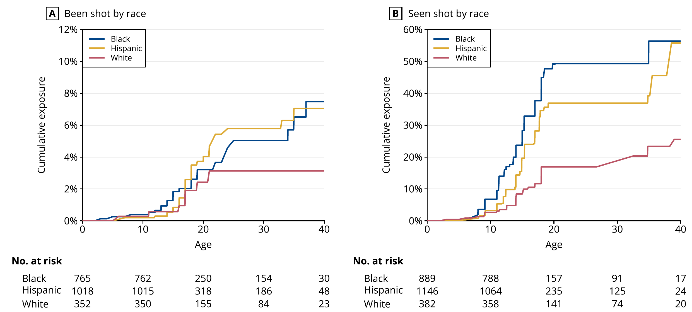
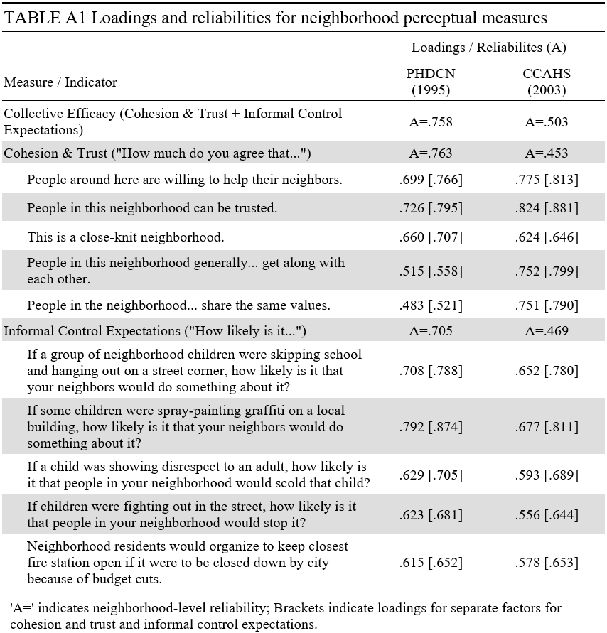
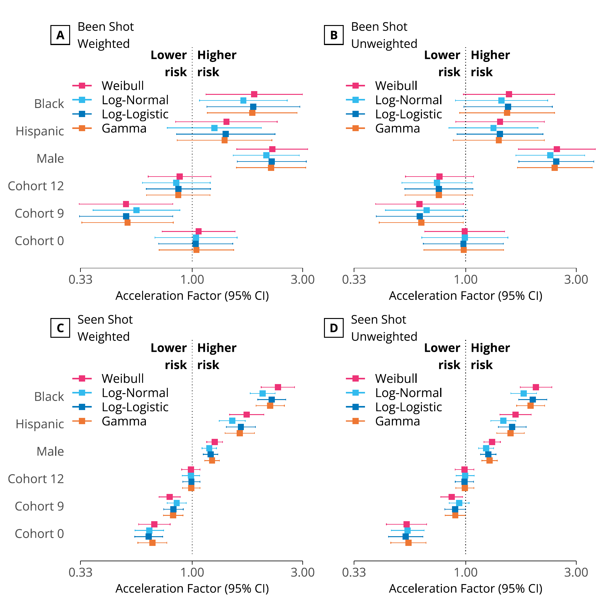
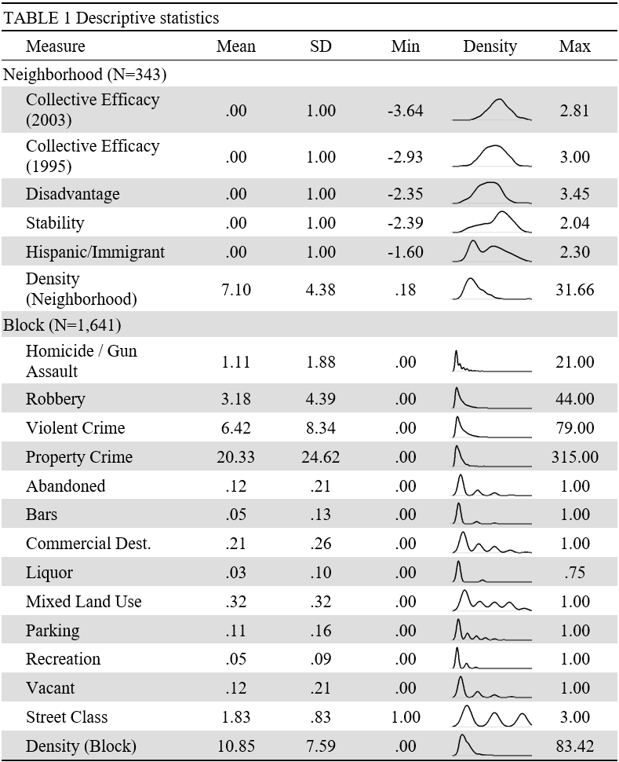
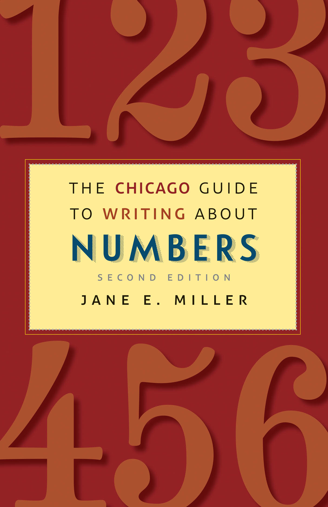

```{r setup, purl=FALSE}
#| include: false
options(width = 68)
set.seed(7)
knitr::opts_chunk$set(eval=TRUE, echo=FALSE, message=FALSE, warning=FALSE, dev = "svg", fig.height = 4)
library(tidyverse)
library(flextable)
```


# Today

## Writing in General

## Describing Methods

## Presenting Results

--

<br>
<br>
<br>

.text-center[
*But first...*
]

---

class: inverse

.text-big-center[
Sign up for interviews
]

.text-center[
Attendance **will not count** without participation

Participation requires **signing up**
]

---

class: inverse

# Writing

<br>


---

## Target your writing

Professional (academic) writing is purposeful **communication** to an audience

--

.pull-left[
* Know the purpose

   + Argument
   + Description
   + Theoretical test
   + Policy evaluation
]

--

.pull-right[
* Know the audience

   + Examiners (e.g., essay or thesis)
   + Academics (e.g., journal)
   + Policy actors (e.g., policy brief)
   + Lay people (e.g., public scholarship)
]

--

.text-center[
*Everything you write should serve your purpose and be understood by your audience*
]


---

## When you write

.pull-left[
* **Clarity comes first**

   * *Do not write so you can be understood, but so that so you cannot be misunderstood*
]

.pull-right[

]

---
count:false

## When you write

.pull-left[
* **Clarity comes first**

   * *Do not write so you can be understood, but so that so you cannot be misunderstood*

* **Read** good books on writing &rarr;

* **Read** and emulate good writers

* **Read** your work out loud

   * *Good writing seems natural*
]

.pull-right[

]

---
count:false

## When you write

.pull-left[
* **Clarity comes first**

   * *Do not write so you can be understood, but so that so you cannot be misunderstood*

* **Read** good books on writing &rarr;

* **Read** and emulate good writers

* **Read** your work out loud

   * *Good writing seems natural*

* Have others read your work

   * *When someone says something is confusing they are always right*
]

.pull-right[

]

---

## Empirical papers: Matsueda (2019)

.pull-left-70[
* Empirical, especially quantitative, writing has a common structure
   + Efficient communication—*deviate at your peril*
   + **Hourglass** shape
      * Start with big picture
      * Narrow to what you did
      * Relate back to big picture
   
* **Mimic others**:
   * Prominent outlets
   * Good writers
   
* Highlight your contributions

* Literature reviews are **important**
   * Position your work in the conversation
]

.pull-right-30[
&nbsp;<br>
&nbsp;<br>
&nbsp;<br>

]

---

# Structure

Empirical articles rarely stray far from this:

1. Abstract
2. Introduction
3. Literature Review / Background
4. **Methods**
5. **Results**
6. **Discussion**
7. Conclusion<sup>1</sup>

.footnote[
[1] Often in discussion rather than separate
]

--

<br>

.text-center[
*We'll mainly focus on methods, results, and discussion*
]

---

## Abstract

* An elevator speech: Summarize the entire paper in 200 words

--

## Introduction

* **Hook the reader**
* State the research question
* Highlight contribution or main findings (optional)
* Foreshadow the structure of paper

--

## Literature Review / Background

* **Motivate the research question and design**
   * This section is an **argument** not a summary
* Support key assumptions and arguments
   * *Your theoretical model and every variable should be covered*
* Lay out hypotheses
   * *This is often done in its own section between background and methods*


---
class: inverse

# Data and Methods

<br>


---

## What to Include

.pull-left[

From reading:

* **Be complete**

   + *Describe everything you did*

* **Be clear**

   + *Describe each thing in sufficient detail for the average reader to understand what was done*

* **Be credible**

   + *Justify your choices*
      + Data and method
   + What you did should follow logically from your **research design**
]

--

.pull-right[
From me:

* **Know your audience**

   + *Journal of Quantitative Criminology*
   + *Criminology*
   + Policy reports
   + Public scholarship

* **Lean on references**

   + "Following Sampson et al. (1997), I..."

* **Do not oversell**
]

---

## Data

* **Where** and **when** it was collected

   + e.g., London in 2014–2018

--

* **How** it was collected

   + *Sampling design and measurement method*
   + e.g., random-digit-dial phone survey

--

* What are the **units**?

   + *Both for collection and analysis*
   + e.g., individual survey responses aggregated to wards

--

* **Excluded** or **missing** data

   + *Both what is missing and what you did about it*
   + Include non-response and loss to follow-up

--

* What **transformations** or **modifications** were made
   + *What you did and why*
   + e.g., standardization

---

## Methods

* Statistical method

   + *What you did and why—and why **not** other ways*
   + e.g.: 
      + "Crime was modelled using Poisson regression because the outcome is a strictly non-negative integer."
      + "We control for unstructured socialization as it is a known confounder for..."
      + "I did not control for ambient population, because it is a mediator for..."

--

* The more established the approach, the less detail you need

   * Linear regression needs a sentence
   * A structural equation needs a paragraph
   * New approaches can require an entire paper

--

.text-center[
*Level of detail and justification is context-specific; a common approach in one subfield may be new to another*
]

---

## Communicate the three quantities


.pull-left-60[

* **Estimand**: the real-world quantity we want to measure

   + Your **literature review** justifies interest in the estimand; specify it in **methods**


* **Estimator**: the procedure we use to calculate the estimate using data

   + Your **methods section** justifies the use of the estimator


* **Estimate**: the calculated quantity approximating our estimand

   + Your **results section** presents these, under the assumption your estimator is correct
]

.pull-right-40[

]

.footnote[Image credit: [Richard McElreath](https://twitter.com/rlmcelreath/status/1582368904529137672)]


---
class: inverse

# Presenting Results

<br>
<br>


.footnote[
[1] Source: Lanfear, Bucci, Sampson, & Kirk (Under review)
]

---

## Where numbers go

.container[
.column[

.text-center[
### Text
]

* **Key evidence**
   + Main estimates
   + Big "hooks"
* Important standalone values
   + e.g., sample size
* **Very few at a time**
* **Nothing unimportant**
]
.column[

.text-center[
### Table
]

* Precise values for look up
   + **Descriptive statistics**
   + Model estimates
* Many values of different kinds
   + Data tables
]
.column[

.text-center[
### Figure
]

* **Everything else**
* Especially:
   + Comparisons with similar data
   + Multivariable relationships
   + Anything hard to explain verbally
]
]

---

# Text

For values in text (and tables)...

.pull-left[

* Use appropriate **precision**

   + Bad: $3.1445 \pm 0.2331$
   + Good: $3.14 \pm 0.23$

* Use appropriate **scaling**

   + Bad: $\beta=0.0025\text{km}$
   + Good: $\beta=2.5 \text{m}$
]

--

.pull-right[

* Use **units**

   + "30 more burglaries"
   + "1 SD higher robbery (23 robberies)"
   + "A 5 percentage point difference"
   + "25 percent more thefts"

]


--

* Recognize **substantive** and **statistical** significance

   * Detecting something and caring about it are different things

--

<br>

.text-center[
*Present only numbers that serve your objective and are meaningful to your audience*
]

---
## Writing about relationships

Your design determines if estimated relationships are plausibly causal or not

--

.pull-left[
&zwj;**Causal** language:

* "increases"
* "affects"
* "influences"
]

--

.pull-right[
**Non-causal** language:

* "is associated with"
* "correlates with"
* "is positively related to"
]

--

<br>

.text-center[
*Do not try to be clever about this*
]

--

<br>

In either case, note when this relationship is found controlling for other variables:

> "Conditional on sociodemographic structure of neighborhoods, we find a 1 standard deviation increase in collective efficacy to be associated with a 17.5% reduction in violent crime in the next year."


---

## Text Examples

Highlighting big hooks:

> Race and ethnic differences in exposure to firearm violence are pronounced, with both forms of exposure highest for Black respondents (Figure 2A). By age 40, an estimated 7.47% of Black and 7.05% of Hispanic respondents had been shot, with one Black and one Hispanic respondent fatally shot. In contrast, an estimated 3.13% of White respondents were victims of a shooting by age 40.<sup>1</sup>

.footnote[
[1] Lanfear, Bucci, Sampson, & Kirk (Under review)<br>&nbsp;
]

--

Main estimates:

> A 1 standard deviation higher level of abandoned buildings—21 percent more block faces with abandoned buildings on and around that block—is expected to be associated with, on average, approximately 20 percent more homicides and gun assaults than an otherwise similar block.<sup>2</sup>

.footnote[
[2] [Lanfear (2022)](https://doi.org/10.1111/1745-9125.12304)
]

---

# Tables

*Tables should stand alone*

.pull-left[
* Title, headings, notes, and structure should convey:
   + Purpose
   + Context
   + Units
   + Source of data
   + Definitions of abbreviations


]

--

.pull-right[
* Make them **simple** and **intuitive**
   * No ornamentation
      + Lines only to guide eyes
   * Values with proper scale and precision
   * Order rows and columns purposefully
]

--

Creating tables:

.container[
.pull-left[
* Non-Programmatic

   * Word / Google Docs
   * Excel / Google Sheets
]
.pull-right[
* Programmatic

   * R / R Markdown
   * $\LaTeX$ (plz no)
]
]

---


.footnote[
Source: APA Publication Manual, 7th Ed.
]

---
## An example

```{r, echo = FALSE}
tribble(~Condition, ~`Walk-By`, ~Mail, ~Theft,
        "Control", 1496, 176, 28,
        "Treatment", 1617, 136, 28
       ) |>
  pivot_longer(`Walk-By`:Theft, names_to = "Outcome", values_to = "Count") |>
  group_by(Condition) |>
  mutate(Prop = Count / sum(Count)) |>
  mutate(Prop = paste0(format(round(Prop*100,1), nsmall =1), "%"),
         Count = as.character(Count)) |>
  pivot_longer(-c(Condition, Outcome)) |>
  pivot_wider(names_from = Outcome, values_from = value) |>
  select(-name) |>
  flextable() |>
  border_remove() |>
  merge_v(j = 1) |>
  width(j = 1, 1.5) |>
  width(j = 2:4, 1.2) |>
  hline_top(j = 2:4, part = "body") |>
  hline_bottom(j = 1:4) |>
  hline_bottom(part = "header") |>
  fontsize(size = 16, part = "all") |>
  add_header_lines("Table 1. Actions by treatment condition") |>
  fix_border_issues(part = "all")
  
```

**Causal** design:

* "There was no **effect** of treatment on theft."
* "The treatment **reduced** mailing by 2.8 percentage points."

---


.footnote[Source: [Lanfear (2022)](https://doi.org/10.1111/1745-9125.12304)]

---

# Figures

* What do we put in figures?

   + *Nearly everything, if possible*
   + Model results
   + **Maps!**
   
--

* *Figures should stand alone*

   + Use informative titles and labels
   + Include detailed captions

--

* Visualization is hard!

   + Too involved to scratch surface today
   + Take courses on visualization, e.g.:
      * [Chris Adolph free materials](http://faculty.washington.edu/cadolph/index.php?page=22)
      * [Nathan Yau's affordable *Flowing Data*](https://flowingdata.com/)
   + *Read books*

---

## An Example

.pull-left[

]
.pull-right[
.text-85[
eFigure 2: Interval Censored Accelerated Failure Time Models

Squares represent acceleration factor point estimates from AFT models that relax the proportional hazards assumption of the main text SPT proportional hazards models. AFT estimates may be sensitive to the distribution chosen, so four different parametric specifications are presented. Results are similar across all specifications but the best fit by AIC is obtained from the log-normal model in all panels except A, where the log-logistic specification is preferred.
]
]

.footnote[
[1] Source: Lanfear, Bucci, Sampson, & Kirk (Under review)
]

---

## Book Recommendations

.pull-left[


* With programming (in R)

]
.pull-right[


* Without programming
]


---

## Put plots in tables!



.footnote[Source: [Lanfear (2022)](https://doi.org/10.1111/1745-9125.12304)]

---

.pull-left-40[

]
.pull-right-60[
.text-72[
## Describe in detail!

Figure 3. Model Estimates of Disparities in Exposure to Gun Violence to Age 40

Hazard ratios (HR) and incidence rate ratios (IRR) greater than 1 indicate higher estimated exposure to gun violence. HRs were estimated with a semi-parametric Turnbull proportional hazards model. IRRs were estimated with a negative binomial regression. Models are weighted to permit generalizing estimates of exposure to the population of children coming of age in Chicago in the 1990s. Case weights applied during estimation are constructed from a combination of original survey design weights and weights for attrition constructed using predictions from binary logistic regression models. The final weights used in the analysis are the product of the survey design weights and attrition weights at each wave. Observations receive the combined weight at their final follow-up period (e.g., an individual observed through wave 3 would receive a weight equal to the product of the survey design weight, their wave 2 attrition weight, and their wave 3 attrition weight). Results are insensitive to trimming weights to the center 90% of the distribution. Results are also similar as alternative specifications of survival models (see eFigure 2) and without weights (see eFigure 3). Sample sizes are 2,417 for seen shot, 2,135 for been shot, and 649 for nearby shootings.
]
]

.footnote[Source: Lanfear, Bucci, Sampson, & Kirk (Under review)]


---

# Discussion

* Limitations

   * *Be honest but not self-flagellating*
      * Don't present only trivial weaknesses
      * Do note if you improve on past methods
   * Specify how future research can address them

--

* Implications

   * New or unanswered research questions
   * Connect back to theories
   * Resist making policy prescriptions (unless the goal of the paper)
      * Drawing *attention* to a problem is fine

--

* Finish strong and **upbeat**

   * "Despite these limitations, this study contributes to our understanding..."
   * Reiterate most significant takeaways
   * *Some people skip right to the conclusion, so use **hooks** here too*

---

class: inverse

# Moving Forward

.pull-left[
Read books on:

* Writing
* Presenting results

Read articles

* Pay attention to **style** in addition to content
* Take note of effective figures

**Practice!**


]
.pull-right-40[

]

---

class: inverse

.text-big-center[
Sign up for interviews
]

.text-center[
Attendance **will not count** without participation

Participation requires **signing up**
]

