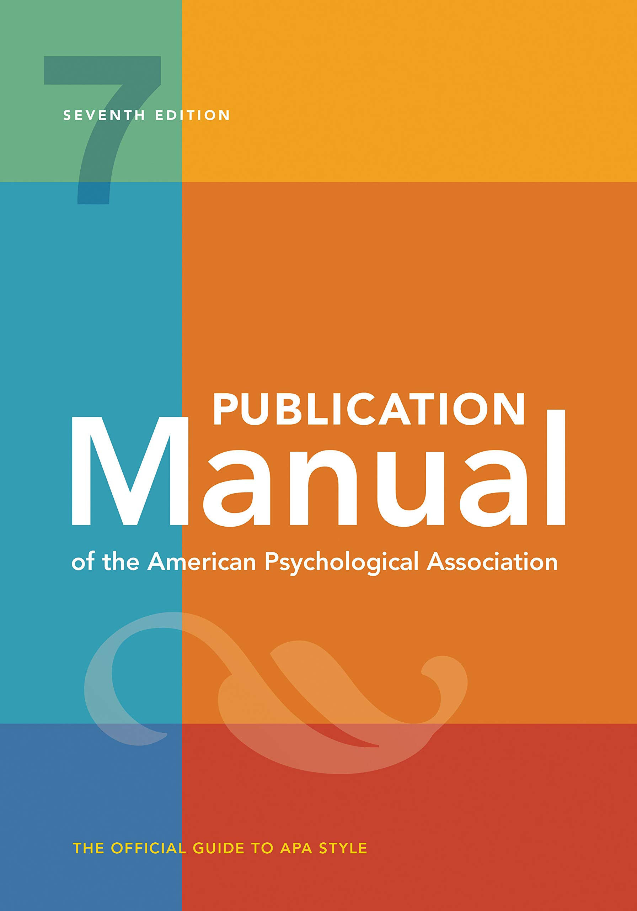
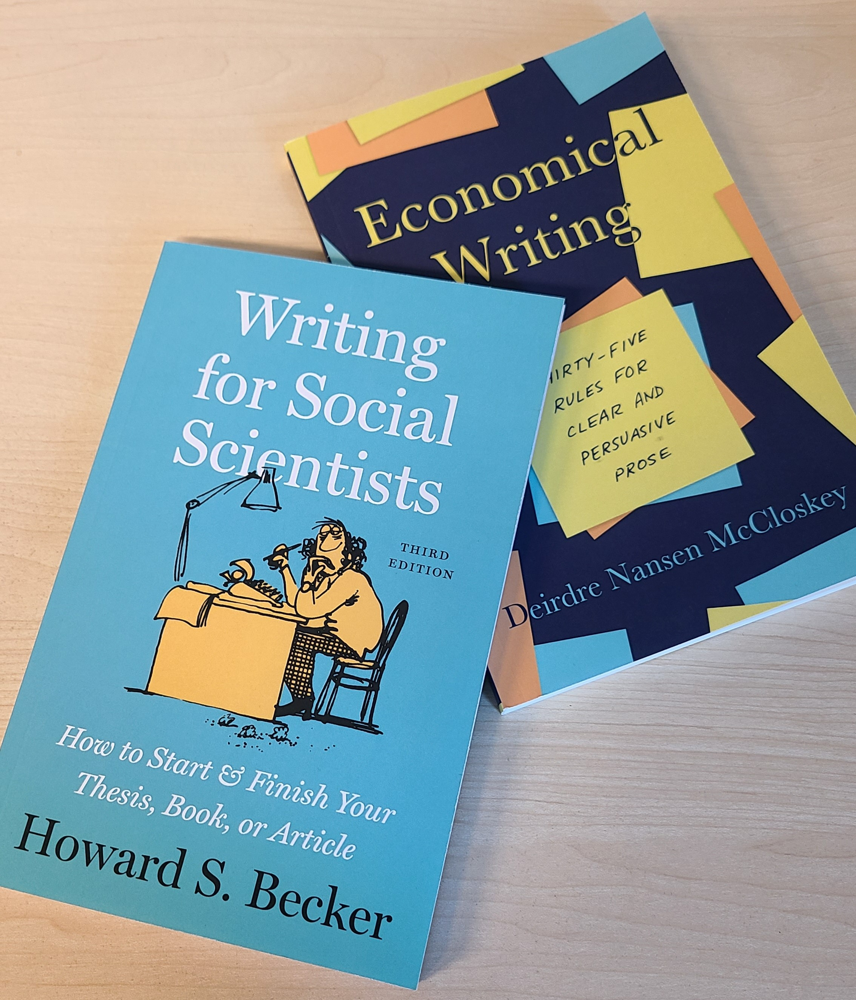

```{r setup, purl=FALSE}
#| include: false
options(width = 68)
set.seed(7)
knitr::opts_chunk$set(eval=TRUE, echo=TRUE, message=FALSE, warning=FALSE, dev = "svg", fig.height = 4)
```


# Outline

### Writing

### Tables

### Charts

---

class: inverse

# Writing in General

---

# Matsueda (2019)

.pull-left-70[
* Empirical writing has a common structure
   * Efficient for communication
   * Hourglass shape
* Mimic others:
   * Articles in prominent outlets
   * Good writers
* Highlight your contributions
* Literature reviews are important
   * Position your work
   * Argument and conversation, not summary
]

.pull-right-30[

]


---
# APA: Grammar

.pull-left-60[


Past / present perfect tense:

* Literature review
* Methods and results
* "Sampson et al. (1997) observed..."
* "The treatment decreased..."

Present tense:

* Discussion
* Conclusions
* "Our results indicate..."
* "This study is limited in that..."

]
.pull-right-40[

]

---
# APA: Numbers

.pull-left-60[
Use words for:

* Numbers from 0 to 9
* Common fractions and phrases (e.g., one tenth)
* The start of a sentence

Other rules:

* Round to 2 or 3 places
* Do not report statistics in both text and tables or figures
* [See the APA style guide](https://apastyle.apa.org/instructional-aids/numbers-statistics-guide.pdf)
]
.pull-right-40[

]

---

# General Tips

.pull-left[
* Clarity comes first

* **Read** good books on writing →

* **Read** and emulate good writers

* **Read** your work out loud

   * *Good writing seems natural*

* Have others read your work

   * *When someone says something is confusing they are always right*
]

.pull-right[

]

---
class: inverse

# Describing Methods

---

.pull-left[

From reading:

* Completeness
* Clarity
* Credibility
]

From reality:

Context-specific

Complete in JQC is too much for Criminology
Complete in Criminology is too much for a report to stakeholders


---
class: inverse

# Presenting Results

---

# Where numbers go

.container[
.column[

.text-center[
### Text
]

* Key evidence
   + Main estimates
   + Big "hooks"
* Important standalone values
   + Sample size
   + Response rate
* **Nothing unimportant**
]
.column[

.text-center[
### Table
]

* Relatively few numbers
   + Cross-tabs
* Precise values for look up
   + Descriptives
   + Complete model estimates
]
.column[

.text-center[
### Figure
]

* **Everything else**
* Especially:
   + Comparisons
   + Multivariable relationships
   + Anything hard to explain verbally
]
]


---
# Text

Do not describe everything


---

# Tables

Tables should stand alone

Style

* Few lines
* Few digits
* Order rows and columns logically

---
class: inverse

# Plots


Figures should stand alone

Won't spend much time here—read books and take courses on visualization

---

## What do we plot

---
# Principles

Chart junk
Small multiples

---


---

# Wrap-Up

### Moving Forward


