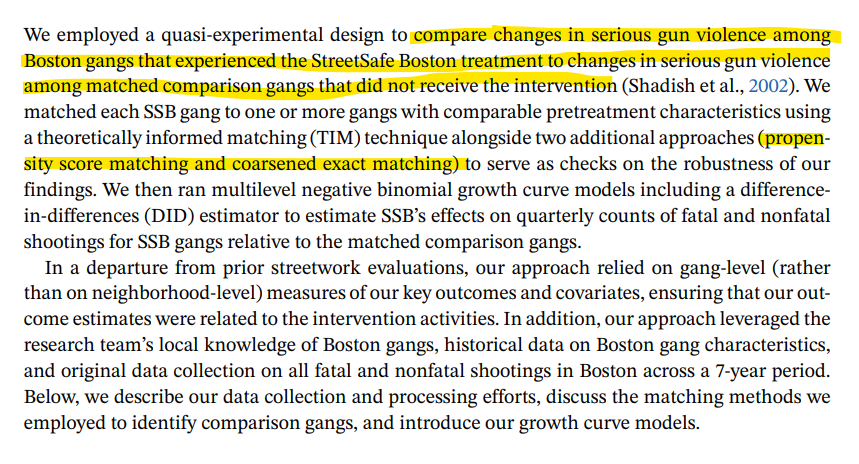
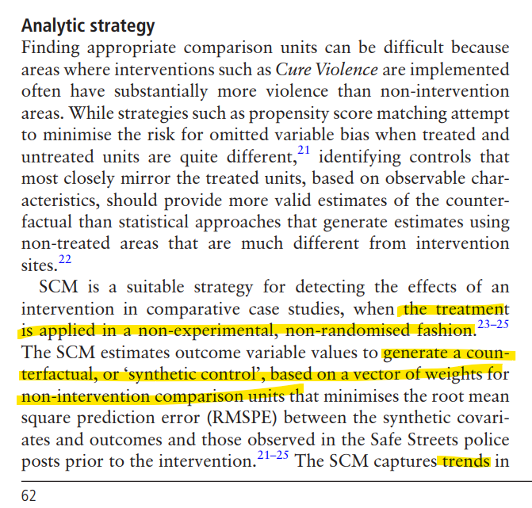

```{r setup, include=FALSE}
library(tidyverse)
studies <- readxl::read_excel("./study_ratings.xlsx")
```


## STUDY 1

.pull-left[

`r studies$full_study[studies$order==1]`

**My score:** `r studies$Rating[studies$order==1]`

* Propensity score matching
* Before-and-after 

]
.pull-right[

]


---

## STUDY 2

.pull-left[

`r studies$full_study[studies$order==2]`

**My score:** `r studies$Rating[studies$order==2]`

* Before-and-after
* Dissimilar comparison group

]
.pull-right[

]


---

## STUDY 3


.pull-left[

`r studies$full_study[studies$order==3]`

**My score:** `r studies$Rating[studies$order==3]`

* RCT
* Maybe issues with compliance

]
.pull-right[

&nbsp;


]

---

## STUDY 4

.pull-left[

`r studies$full_study[studies$order==4]`

**My score:** `r studies$Rating[studies$order==4]`

* Before-and-after
* Matched comparison group

]
.pull-right[

]

---

## STUDY 5

.pull-left[

`r studies$full_study[studies$order==5]`

**My score:** `r studies$Rating[studies$order==5]`

* Before-and-after
* No comparison group

]
.pull-right[

]

---

## STUDY 6

.pull-left[

`r studies$full_study[studies$order==6]`

**My score:** `r studies$Rating[studies$order==6]`

* Before-and-after
* Comparison group (ambiguous if comparable)

]
.pull-right[


&nbsp;


]

---

## STUDY 7

.pull-left[

`r studies$full_study[studies$order==7]`

**My score:** `r studies$Rating[studies$order==7]`

* Before-and-after
* Covariate control

]
.pull-right[

]

---

## STUDY 8

.pull-left[

`r studies$full_study[studies$order==8]`

**My score:** `r studies$Rating[studies$order==8]`

* Before-and-after
* Matched comparison

]
.pull-right[

]

---

## STUDY 9

.pull-left[

`r studies$full_study[studies$order==9]`

**My score:** `r studies$Rating[studies$order==9]`

* Only post-treatment comparison
* Matching on covariates

]
.pull-right[

]

---

## STUDY 10

.pull-left[

`r studies$full_study[studies$order==10]`

**My score:** `r studies$Rating[studies$order==10]`

* Before-and-after
* Covariate control


]
.pull-right[

]

---

## STUDY 11

.pull-left[

`r studies$full_study[studies$order==11]`

**My score:** `r studies$Rating[studies$order==11]`

* Before-and-after for treated group
* City-level comparison

]
.pull-right[

]

---

## STUDY 12

.pull-left[

`r studies$full_study[studies$order==12]`

**My score:** `r studies$Rating[studies$order==12]`

* Before-and-after
* Covariate control

]
.pull-right[

]

---

## STUDY 13

.pull-left[

`r studies$full_study[studies$order==13]`

**My score:** `r studies$Rating[studies$order==13]`

* Before-and-after
* Comparison group
* Placebo test with non-targeted crime

]
.pull-right[

]

---

## STUDY 14

.pull-left[

`r studies$full_study[studies$order==14]`

**My score:** `r studies$Rating[studies$order==14]`

* Before-and-after
* Matched comparison

]
.pull-right[

]

