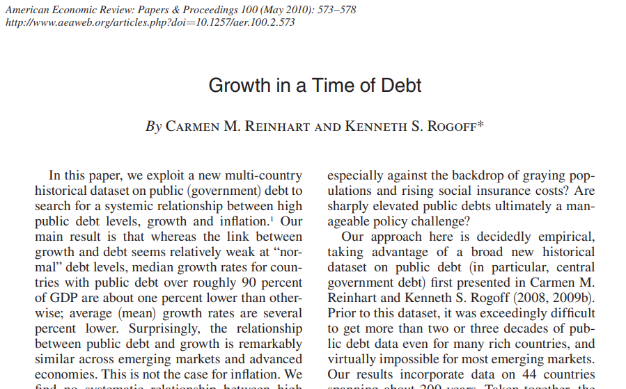

```{r setup, purl=FALSE}
#| include: false
options(width = 68)
set.seed(7)
knitr::opts_chunk$set(eval=TRUE, echo=TRUE, message=FALSE, warning=FALSE, dev = "svg", fig.height = 4)
```


# Today

### Reproducible Research

   * What it means
   * Some tools

### Best Practices

   * Organization
   * Portability

### Quarto

   * An introduction
   * Some practice

---
class: inverse

# Reproducible Research

<br>



.text-center[
[Ways to avoid this sort of thing](https://en.wikipedia.org/wiki/Growth_in_a_Time_of_Debt)
]

---
# Why Reproducibility?

Reproducibility is not *replication*.

* **Replication** is running a new study to test if results from a prior study hold.
* **Reproducibility** is rerunning *the same study* and getting the *same results*.

--

Reproducible studies can still be *wrong*... and reproducibility makes proving studies wrong *much easier*.

--

Reproducibility means:

* Transparent research practices.
* Minimal barriers to verifying your results.

--

.text-center[
*Any study that isn't reproducible can be trusted only on faith.*
]

---
# Reproducibility Definitions

Reproducibility comes in three forms (Stodden 2014):

--

1. **Empirical:** Repeatability in data collection.

--

2. **Statistical:** Verification with alternate methods of inference.

--

3. **Computational:** Reproducibility in cleaning, organizing, and presenting data and results.

--

R is particularly well suited to enabling **computational reproducibility**.

--

It will not fix flawed research design, nor offer a remedy for improper application of statistical methods.

Those are the difficult, non-automatable things you want skills in.

---

## Computational Reproducibility

Elements of computational reproducibility:

--

* **Shared data**

   + Researchers need your original data to verify and replicate your work.

--

* **Shared code**
   + Your code must be shared to make decisions transparent.

--

* **Documentation**
   + The operation of code should be either self-documenting or have written descriptions to make its use clear.

--

* **Version Control**
   + Documents the research process
   + Prevents losing work
   + Facilitates sharing

---

## Levels of Reproducibility

For academic papers, degrees of reproducibility vary:

0. "Read the article"

--

1. Shared data with documentation

--

2. Shared data and all code

--

3. **Literate programming**

--

4. **Research compendium**

--

5. Docker compendium: Self-contained ecosystem

---
## Literate programming

**Literate programming** combines code and text together into a the same self-contained document.
   * Load and process data
   * Run models
   * Generate tables and plots in-line with text
   * In-text values automatically filled in

--

Literate programming allows a reader to examine your computational methods within the document itself.

--

By re-running the code, they reproduce your results on demand.

--

Common Platforms:

 * R Markdown (R *mostly*)
 * Jupyter Notebooks (Python)
 * **Quarto** (R, Python, Julia)

--

.text-center[
*We'll cover and practice this in a bit*
]

---
## Research Compendia

A **research compendium** is a portable, reproducible distribution of a project.

--

Research compendia feature:

* A literate programming document as the foundation

* Files organized in a recognizable structure

* Clear separation of data, method, and output. *Data are read only*.

* Well-documented or even *preserved* computational environment (e.g. Docker)

--

Compendia are commonly managed via git repositories:

* Ex: [Lanfear, C. C. (2022). Repository of R code and data for ‘Collective Efficacy the Built Environment.'](https://github.com/clanfear/built_environment_ce)

Or on platforms like Harvard's Dataverse:

* Ex: [Lanfear, C. C., Bucci, R., Kirk, D. S., Sampson, R. J. (2023) "Reproduction Files for: Inequalities in Exposure to Firearm Violence by Race, Sex, and Birth Cohort from Childhood to Age 40 Years, 1995-2021."](https://doi.org/10.7910/DVN/YWZL5K)

---

## Quarto & Bookdown

Quarto and R Markdown's [`bookdown`](https://bookdown.org/yihui/bookdown/) generate properly formatted articles, books, and dissertations.

--

* Integrate citations and automate reference pages using bibtex files (even directly from Zotero)

--

* More accessible than $\LaTeX$ for typesetting and reference management

--

* More consistent, flexible, and reproducible than Word and Google Docs

--

* Generate submission-ready `.docx` or publication-ready `.html` or `.pdf` documents at the same time:

   * Ex: [R for Data Science](https://r4ds.had.co.nz/)
   * Ex: [Fundamentals of Data Visualization](https://clauswilke.com/dataviz/)

--

.text-center[
*We'll get to these in a bit.*
]

---
class: inverse
# Organization


---
# Organization Systems

Organizing research projects is something you either do accidentally—and badly—or purposefully with some upfront labor.

--

Uniform organization makes switching between or revisiting projects easier.

--

I suggest something like the following:

.pull-left[
```
project/
   code/
     functions.R
     models.R
   data/
     derived/
       processed_data.RData
     raw/
       core_data.csv
   docs/
     memo_2022-06-22.pdf
     memo_2022-09-01.pdf
     paper.Qmd
   readme.md

```
]
.pull-right[
1. There is a clear hierarchy
   * Documents are in `docs`
   * Code is in `code`
   * Data are in `data`
2. Naming is uniform
   * All lower case
   * Words separated by underscores
3. Names are unambiguous
   * Machine and human readable
]

---
# Workflow versus Project

To summarize Jenny Bryan, [one should separate workflow from projects.](https://www.tidyverse.org/articles/2017/12/workflow-vs-script/)

--

.pull-left[
### Workflow

* The software you use to write your code (e.g. RStudio)

* The location you store a project

* The specific computer you use

* The code you ran earlier or typed into your console
]

--

.pull-right[
### Project

* The raw data

* The code that operates on your raw data

* The packages you use

* The output files or documents
]

--

Projects *should not modify anything outside of the project* nor need to be modified by someone else (or future you) to run.

.text-center[
**Projects *should be independent of your workflow*.**
]

---
# Portability

For research to be reproducible, it must also be *portable*. Portable software operates *independently of workflow* such as fixed file locations.

--

**Do Not:**

* Use `setwd()` in scripts, .Rmd, or .Qmd files.
* Use *absolute paths* except for *fixed, immovable sources* (secure data).
  + `read_csv("C:/my_project/data/my_data.csv")`
* Use `install.packages()` in script or .Rmd files.
* Use `rm(list=ls())` anywhere but your console.

--

**Do:**

* Use RStudio projects, the [`here` package](https://github.com/jennybc/here_here), or R/Qmd docs to set directories.
* Use *relative paths* to load and save files:
  + `read_csv("./data/my_data.csv")`
* Load all required packages using `library()`.
* Clear your workspace when closing RStudio.
  + Set *Tools > Global Options... > Save workspace...* to **Never**

---
# Divide and Conquer

Usually you do not want to include all code for a project in one `.Qmd` file:

   * The code takes too long to knit.
   * The file is too long to read.
   * Journals want separate figures and tables.

--

There are two ways to deal with this:

1. Use separate `.R` scripts or `.Qmd` files which save results from complicated parts of a project, then load these results in the main `.Qmd` file.

   + Good for loading and cleaning large data
   + Also for running slow models
   + Reliable but need a core script to run everything

--

2. Use `source()` to run external `.R` scripts when the `.Qmd` knits.

   + This can be used to run large files that aren't impractically slow.
   + Also good for loading project-specific functions
   + Sometimes finicky for arcane reasons

---

# Pipelines

Professional researchers and teams design projects as a **pipeline**.

--

A **pipeline** is a series of consecutive processing elements (e.g., scripts and functions).

--

Each stage of a pipeline...

1. Has clearly defined inputs and outputs
2. Does not modify its inputs
3. Produces the exact same output every time it is re-run

--

This means...

1. When you modify one stage, you only need to rerun *subsequent stages*.
2. Different people can work on each stage.
3. Problems are isolated within stages.
4. You can depict your project as a *directed graph* of **dependencies**.

---

# Example Pipeline

Every stage (oval) has an unambiguous input and output. Everything that precedes a given stage is a **dependency**—something required to run it.


.footnote[[`{targets}` is a package for managing R research pipelines.](https://docs.ropensci.org/targets/)]

---

class: inverse

# Literate Programming

<br>


.text-center[
Donald Knuth, creator of $\LaTeX$, and thus also of *tears*
]

---

# Selling you on Quarto

Quarto and R Markdown are powerful tools:
--

* Document analyses by combining text, code, and output

--

  + No copying and pasting results and plots
--

  + Easy for collaborators to understand
--

  + Show as little or as much code as you want
  
--

* Flexible output:

  + PDF documents (requires a $LaTeX$ install such as `{tinytex}`)
  + HTML webpages, reports, and [slides](https://clanfear.github.io/UW_2022-12-09/slides/exposures_slides.html)
  + Office: Word and PowerPoint documents

--

* Works with $\LaTeX$, HTML, and CSS for math and more formatting control

---

# Quick Comparison

.pull-left[
### Quarto

* **The new hotshot**
* Easier setup for references and complex documents
* Works with R, Python, Julia, etc.
* [Beautiful reveal.js slides](https://clanfear.github.io/ncgvr_2024-07-09/slides.html)
* Newer, so...
   * Less online support
   * More bugs
   * Fewer specialty formats
]

.pull-right[
### R Markdown

* **The old warhorse**
* Every imaginable format, provided some setup
* Mainly R
* [Powerful Xaringan slides](https://clanfear.github.io/ioc_crmw/_lectures/reproducible-research/slides_reproducible-research.html)
* Older, so...
   * Better support
   * Fewer, weirder bugs
   * Less new development
]

Both work basically the same way—Quarto can even render all basic R Markdown docs!

--

.text-center[
*We'll focus on Quarto today*
]

---

# Quarto Documents

Let's try making a Quarto file:

1. Choose *File > New File > Quarto Document...*
2. Make sure *HTML Output* is selected and click OK
3. Save the file somewhere, call it `my_first_qmd.Qmd`
4. Click the *Render* button
5. Watch the progress in the Jobs pane, then gaze upon your result!

You may also open up the file in your computer's browser if you so desire, using the *Open in Browser* button at the top of the preview window.

---

# Quarto YAML Headers

The header of a Quarto file is a [YAML](https://en.wikipedia.org/wiki/YAML) (YAML Ain't Markup Language<sup>1</sup>) code block, and everything else is part of the main document.

.footnote[[1] Nerds love recursive acronyms.
 ]
--

```{}
---
title: "Untitled"
author: "Charles Lanfear"
date: "February 5, 2025"
format: html
---
```
--

To mess with global formatting, [you can modify the header](http://rmarkdown.rstudio.com/html_document_format.html)<sup>2</sup>.

.footnote[[2] Be careful though, YAML is space-sensitive; indents matter!]

```{}
format:
  html:
    theme: pulse
```

Quarto headers have autocomplete!

---
# Markdown Syntax
.pull-left[

## Output

**bold/strong emphasis**

*italic/normal emphasis*

# Header
## Subheader
### Subsubheader

> Block quote from
> famous person
]

.pull-right[
## Syntax

<pre>
**bold/strong emphasis**

*italic/normal emphasis*


# Header


## Subheader

### Subsubheader

> Block quote from
> famous person
</pre>
]

---

# More Markdown Syntax

.pull-left[
## Output

1. Ordered lists
1. Are real easy
  1. Even with sublists
  1. Or when lazy with numbering
  
* Unordered lists
* Are also real easy
  + Also even with sublists

[URLs are trivial](http://www.uw.edu)


]

.pull-right[

## Syntax

<pre>
1. Ordered lists
1. Are real easy
  1. Even with sublists
  1. Or when lazy with numbering

* Unordered lists
* Are also real easy
  + Also even with sublists

[URLs are trivial](http://www.uw.edu)


</pre>
]

---

# Formulae and Syntax

.pull-left[
## Output 

You can put some math $y= \left( \frac{2}{3} \right)^2$ right up in there.

$$\frac{1}{n} \sum_{i=1}^{n} x_i = \bar{x}_n$$

Or a sentence with `code-looking font`.


Or a block of code:

<pre>
y <- 1:5
z <- y^2
<pre>
]

.pull-right[

## Syntax

<pre>
You can put some math $y= \left(
\frac{2}{3} \right)^2$ right up in 
there

$$\frac{1}{n} \sum_{i=1}^{n}
x_i = \bar{x}_n$$

Or a sentence with `code-looking font`.

Or a block of code:

    ```
    y <- 1:5
    z <- y^2
    ```
</pre>
]


---

# Formatting Caveats

To keep Quarto and R Markdown dead-simple, they lacks some features you might occasionally want to use. Your options for fancier documents are:

* Use HTML with CSS for custom formatting<sup>1</sup>
* HTML, Word, and $\LaTeX$ Templates<sup>2</sup>

For day-to-day use, plain vanilla HTML docs do the job.

For handouts, memos, and homeworks, default PDFs look surprisingly good!

.footnote[
[1] These slides were created using [Xaringan](https://github.com/yihui/xaringan), a blend of RMarkdown and CSS.

[2] Here be dragons! $\LaTeX$ is powerful but exacts a terrible price.
]

---

# R Code in R Markdown

Inside RMarkdown, lines of R code are called **chunks**. Code is sandwiched between sets of three backticks and `{r}`. This chunk of code...

````{verbatim}
```{r}
summary(cars)
```
````

Produces this output in your document:

```{r}
summary(cars)
```

Insert chunks using `Ctrl-Alt-I` (PC) or `⌘-Option-I` (Mac)


---


# Chunk Options

Chunks have options that control what happens with their code, such as:

````{verbatim}
```{r}
#| echo: false
summary(cars)
```
````

* `echo:FALSE`: Keeps R code from being shown in the document, but still shows result

--

* `eval: FALSE`: Shows R code in the document without running it

* `include=FALSE`: Hides all output but still runs code (good for `setup` chunks where you load packages!)

* `fig.height=5, fig.width=5`: modify the dimensions of any plots that are generated in the chunk (units are in inches)


[There are a *lot* of other options!](https://yihui.name/knitr/options/)

---

# Chunk Labels

You can label chunks in the chunk header or the `label:` option<sup>1</sup>

.footnote[[1] Chunks need *unique* labels or you'll get an error!]

````{verbatim}
```{r summarize-cars-1}
#| echo: false
summary(cars)
```
````

````{verbatim}
```{r}
#| label: summarize-cars-2
#| echo: false
summary(cars)
```
````
    
Labels enable browsing in the lower-left *Chunk Label* menu

* You can browse by headers and subheaders too


---

# In-Line R code

We cab insert values directly into our text using code in backticks starting with `r`.
--

```{r, echo=FALSE}
library(knitr)
```

*Write this in your Quarto doc:*

```{verbatim}
Four score and seven years ago is the same as 
`r inline_expr("4*20 + 7", "md")` years.
```

*And you'll get this in your output doc:*

Four score and seven years ago is the same as `r 4*20 + 7` years.

--

Maybe we've saved a variable in a chunk we want to reference in the text:

```{r}
x <- sqrt(77) # <- is how we assign objects
```

--

```{verbatim}
The value of `x` rounded to the nearest two decimals is 
`r inline_expr("round(x, 2)", "md")`.
```

The value of `x` rounded to the nearest two decimals is `r round(x, 2)`.

---

# This is Amazing!


* Never wonder where a value came from: Look it up in your code!

--

* Consistency! No "find/replace" mishaps or manually updating if calculations change (e.g. reporting sample sizes).

--

* Fewer mistakes: You are more likely to mistype a "hard-coded" number than to write R code that works but gives you the wrong value.

--

* Reference management works this way too:

   * Automatic formatted in-text citations
   * Reference list formatted, alphabetized, and contains only cited content
   * Change entire reference style with one YAML header option

--

.text-center[
*This is all **huge** for writing and, especially, rewriting journal articles*
]

---
class: inverse

# Practice


---
# Practice

1. Make a file hierarchy

   * [Put some data in there!](https://raw.githubusercontent.com/clanfear/ioc_iqa/main/_data/communities.csv)
   
2. Make an RStudio project

3. Make a Quarto doc

   * Code chunks
   * Load data with relative path
   * In-line code
   * Tables

4. Preview features

   * Citations
   * Manual tables
   * Comments

---

# Wrap-Up

### Moving Forward

* Use Quarto docs for your projects!
* [Visit tutorials](https://quarto.org/docs/get-started/hello/rstudio.html)
* Download a compendium and try to replicate results